besthr - Generating Bootstrap Estimation Distributions of HR Data
================
Dan MacLean
11 March, 2026

<!-- badges: start -->
[](https://doi.org/10.5281/zenodo.3374507)
[](https://github.com/TeamMacLean/besthr/actions)
[](https://codecov.io/gh/TeamMacLean/besthr)
<!-- badges: end -->

## Synopsis

besthr is a package that creates plots showing scored HR experiments and
plots of distribution of means of ranks of HR score from bootstrapping.

## Installation

You can install from CRAN in the usual way.

``` r
install.packages("besthr")

# or for the dev version
#install.packages("devtools")
devtools::install_github("TeamMacLean/besthr")
```

## Citation

Please cite as

> Dan MacLean. (2019). TeamMacLean/besthr: Initial Release (0.3.0).
> Zenodo. <https://doi.org/10.5281/zenodo.3374507>

## Simplest Use Case - Two Groups, No Replicates

With a data frame or similar object, use the `estimate()` function to
get the bootstrap estimates of the ranked data.

`estimate()` has a basic function call as follows:

`estimate(data, score_column_name, group_column_name, control = control_group_name)`

The first argument after the

``` r
library(besthr)

hr_data_1_file <- system.file("extdata", "example-data-1.csv", package = "besthr")
hr_data_1 <- readr::read_csv(hr_data_1_file)
```

    ## Rows: 20 Columns: 2
    ## ── Column specification ────────────────────────────────────────────────────────
    ## Delimiter: ","
    ## chr (1): group
    ## dbl (1): score
    ## 
    ## ℹ Use `spec()` to retrieve the full column specification for this data.
    ## ℹ Specify the column types or set `show_col_types = FALSE` to quiet this message.

``` r
head(hr_data_1)
```

    ## # A tibble: 6 × 2
    ##   score group
    ##   <dbl> <chr>
    ## 1    10 A    
    ## 2     9 A    
    ## 3    10 A    
    ## 4    10 A    
    ## 5     8 A    
    ## 6     8 A

``` r
hr_est_1 <- estimate(hr_data_1, score, group, control = "A")
hr_est_1
```

    ## besthr (HR Rank Score Analysis with Bootstrap Estimation)
    ## =========================================================
    ## 
    ## Control: A
    ## 
    ## Unpaired mean rank difference of A (14.9, n=10) minus B (6.1, n=10)
    ##  8.8
    ## Confidence Intervals (0.025, 0.975)
    ##  3.7875, 8.105
    ## 
    ## 100 bootstrap resamples.

``` r
plot(hr_est_1)
```

    ## Confidence interval: 2.5% - 97.5%

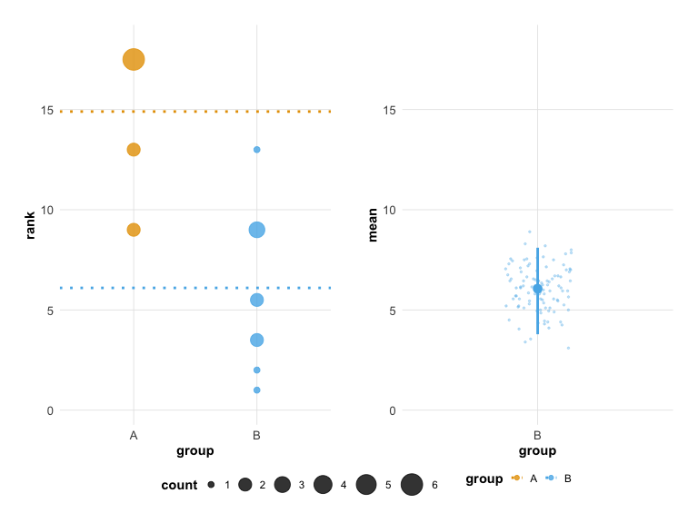<!-- -->

### Setting Options

You may select the group to set as the common reference control with
`control`.

``` r
estimate(hr_data_1, score, group, control = "B" ) %>%
  plot()
```

    ## Confidence interval: 2.5% - 97.5%

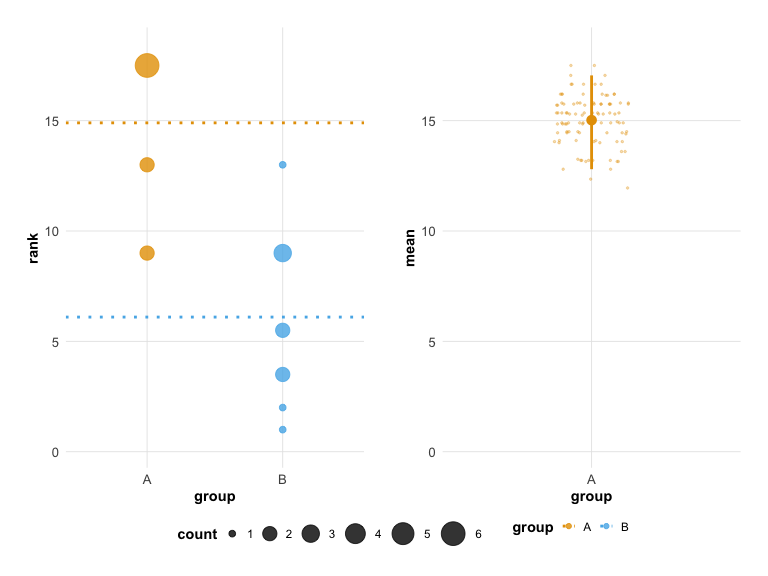<!-- -->

You may select the number of iterations of the bootstrap to perform with
`nits` and the quantiles for the confidence interval with `low` and
`high`.

``` r
estimate(hr_data_1, score, group, control = "A", nits = 1000, low = 0.4, high = 0.6) %>%
  plot()
```

    ## Confidence interval: 40.0% - 60.0%

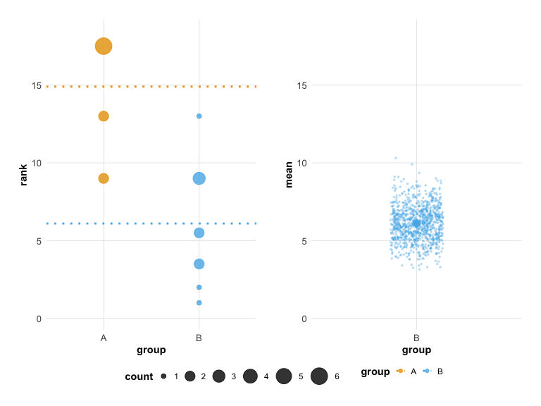<!-- -->

## Extended Use Case - Technical Replicates

You can extend the `estimate()` options to specify a third column in the
data that contains technical replicate information, add the technical
replicate column name after the sample column. Technical replicates are
automatically merged using the `mean()` function before ranking.

``` r
hr_data_3_file <- system.file("extdata", "example-data-3.csv", package = "besthr")
hr_data_3 <- readr::read_csv(hr_data_3_file)
```

    ## Rows: 36 Columns: 3
    ## ── Column specification ────────────────────────────────────────────────────────
    ## Delimiter: ","
    ## chr (1): sample
    ## dbl (2): score, rep
    ## 
    ## ℹ Use `spec()` to retrieve the full column specification for this data.
    ## ℹ Specify the column types or set `show_col_types = FALSE` to quiet this message.

``` r
head(hr_data_3)
```

    ## # A tibble: 6 × 3
    ##   score sample   rep
    ##   <dbl> <chr>  <dbl>
    ## 1     8 A          1
    ## 2     9 A          1
    ## 3     8 A          1
    ## 4    10 A          1
    ## 5     8 A          2
    ## 6     8 A          2

``` r
hr_est_3 <- estimate(hr_data_3, score, sample, rep, control = "A")

hr_est_3
```

    ## besthr (HR Rank Score Analysis with Bootstrap Estimation)
    ## =========================================================
    ## 
    ## Control: A
    ## 
    ## Unpaired mean rank difference of A (5, n=3) minus B (2, n=3)
    ##  3
    ## Confidence Intervals (0.025, 0.975)
    ##  1.15833333333333, 2.84166666666666
    ## 
    ## Unpaired mean rank difference of A (5, n=3) minus C (8, n=3)
    ##  -3
    ## Confidence Intervals (0.025, 0.975)
    ##  7.15833333333333, 9
    ## 
    ## 100 bootstrap resamples.

``` r
plot(hr_est_3)
```

    ## Confidence interval: 2.5% - 97.5%

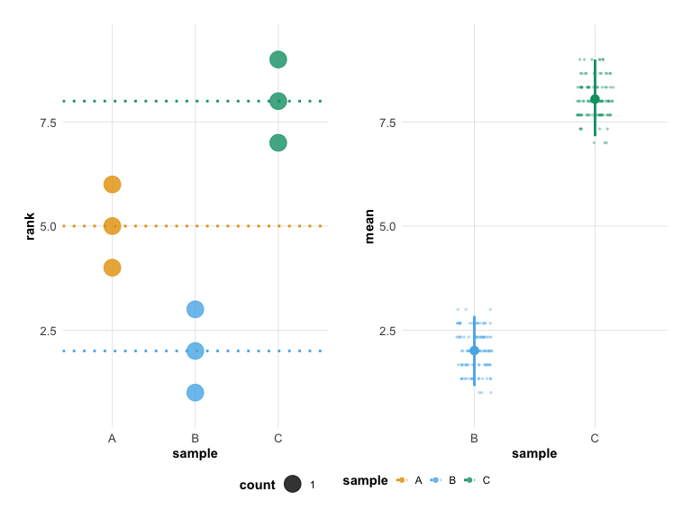<!-- -->

### Alternate Plot Options

In the case where you have use technical replicates and want to see
those plotted you can use an extra plot option `which`. Set `which` to
`just_data` if you wish the left panel of the plot to show all data
without ranking. This will only work if you have technical replicates.

``` r
hr_est_3 %>%
  plot(which = "just_data")
```

    ## Confidence interval: 2.5% - 97.5%

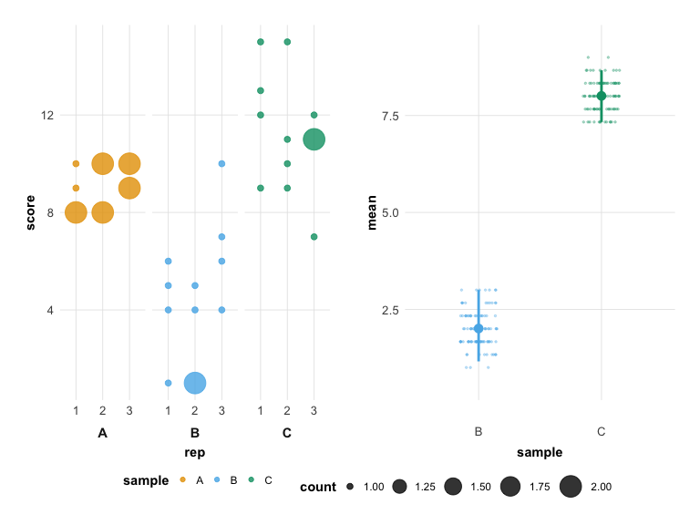<!-- -->

## Built-in Themes and Color Palettes

besthr includes built-in themes and colorblind-safe color palettes that
can be applied directly through the `plot()` function.

### Theme Options

Use the `theme` parameter to change the overall visual style:

- `"classic"` (default) - The original besthr appearance
- `"modern"` - A cleaner, contemporary style with refined typography and
  grid

``` r
# Classic theme (default - same as before)
plot(hr_est_1, theme = "classic")
```

    ## Confidence interval: 2.5% - 97.5%

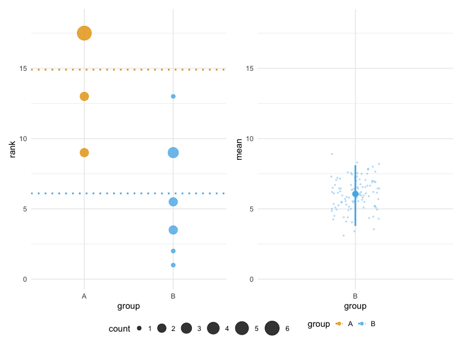<!-- -->

``` r
# Modern theme
plot(hr_est_1, theme = "modern")
```

    ## Confidence interval: 2.5% - 97.5%

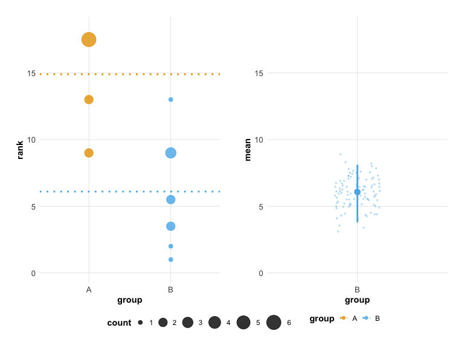<!-- -->

### Color Palette Options

Use the `colors` parameter to change the color palette:

- `"default"` - Original besthr colors
- `"okabe_ito"` - Colorblind-safe Okabe-Ito palette
- `"viridis"` - Viridis color scale

``` r
# Colorblind-safe palette
plot(hr_est_1, colors = "okabe_ito")
```

    ## Confidence interval: 2.5% - 97.5%

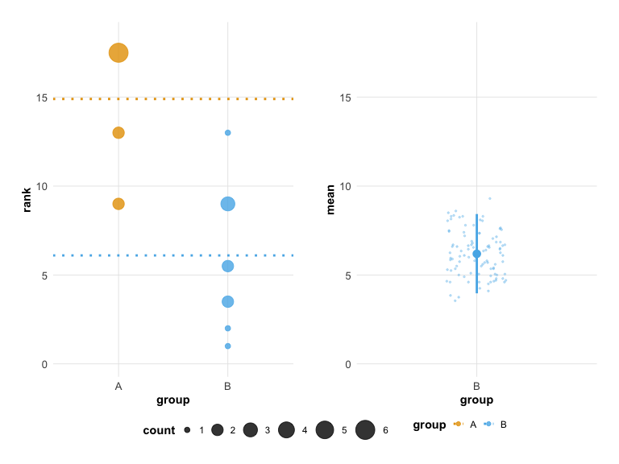<!-- -->

``` r
# Viridis palette
plot(hr_est_1, colors = "viridis")
```

    ## Confidence interval: 2.5% - 97.5%

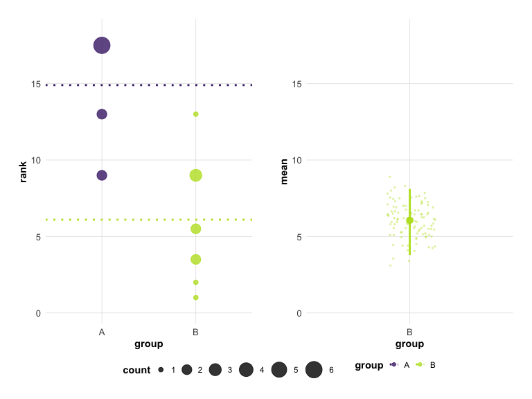<!-- -->

### Combining Theme and Colors

You can combine both options for a fully customized look:

``` r
# Modern theme with colorblind-safe colors
plot(hr_est_1, theme = "modern", colors = "okabe_ito")
```

    ## Confidence interval: 2.5% - 97.5%

<!-- -->

### Using besthr Palettes Directly

The color palettes can also be used directly in your own ggplot2 code:

``` r
# Get palette colors
besthr_palette("okabe_ito", n = 4)
```

    ## [1] "#E69F00" "#56B4E9" "#009E73" "#F0E442"

``` r
# Available palettes
besthr_palette("default", n = 3)
```

    ## [1] "#F8766D" "#00BA38" "#619CFF"

``` r
besthr_palette("viridis", n = 3)
```

    ## [1] "#482576FF" "#21908CFF" "#BBDF27FF"

## Styling Plots

### Recommended: Use Built-in Themes and Colors

The easiest way to style your plots is using the `theme` and `colors`
parameters:

``` r
# Modern look with colorblind-safe colors (this is the default)
plot(hr_est_1, theme = "modern", colors = "okabe_ito")
```

    ## Confidence interval: 2.5% - 97.5%

<!-- -->

``` r
# Classic appearance
plot(hr_est_1, theme = "classic", colors = "default")
```

    ## Confidence interval: 2.5% - 97.5%

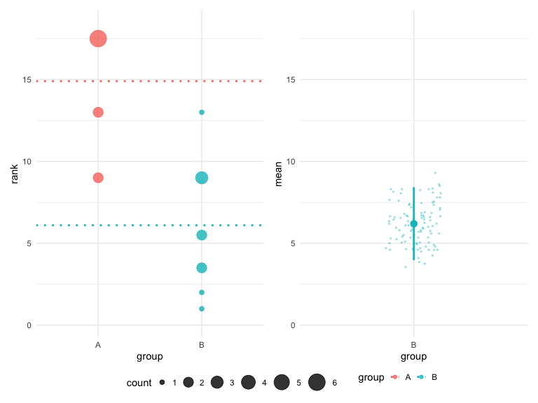<!-- -->

``` r
# Viridis color scheme
plot(hr_est_1, colors = "viridis")
```

    ## Confidence interval: 2.5% - 97.5%

<!-- -->

### Adding Titles and Annotations

The plot object is a `patchwork` composition. You can add titles using
`plot_annotation()`:

``` r
library(patchwork)

p <- plot(hr_est_1)
```

    ## Confidence interval: 2.5% - 97.5%

``` r
p + plot_annotation(
  title = 'HR Score Analysis',
  subtitle = "Control vs Treatment",
  caption = 'Generated with besthr'
)
```

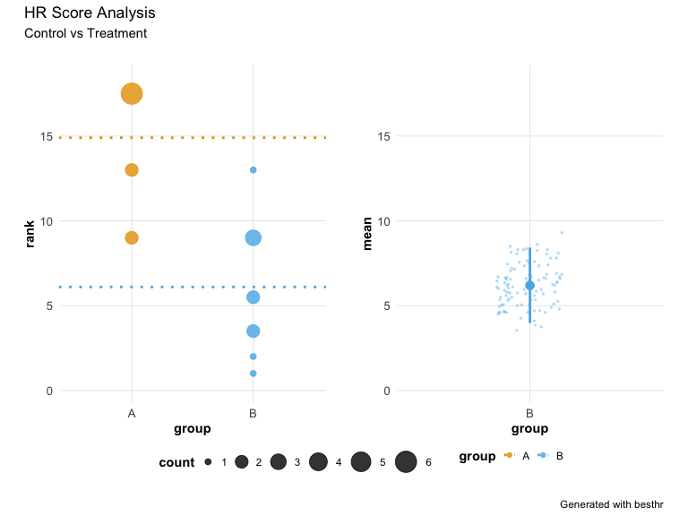<!-- -->

## Raincloud Plot

For a combined view of raw data points with summary statistics, use
`plot_raincloud()`:

``` r
plot_raincloud(hr_est_1)
```

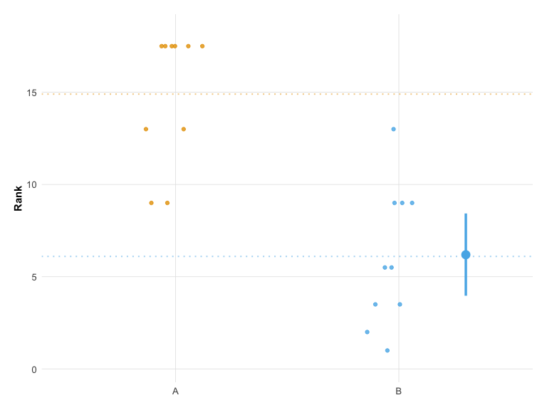<!-- -->

## Significance and Effect Size Annotations

You can add statistical annotations to your plots to highlight
significant results.

``` r
# Create example data with 3 groups and realistic variation
set.seed(42)
d_effect <- data.frame(
  score = c(
    sample(1:4, 12, replace = TRUE),   # Group A: low scores (control)
    sample(4:8, 12, replace = TRUE),   # Group B: medium-high scores
    sample(6:10, 12, replace = TRUE)   # Group C: high scores
  ),
  group = rep(c("A", "B", "C"), each = 12)
)
hr_effect <- estimate(d_effect, score, group, control = "A", nits = 1000)
```

### Significance Stars

Add significance stars to groups where the bootstrap confidence interval
does not overlap the control mean:

``` r
plot(hr_effect, show_significance = TRUE)
```

    ## Confidence interval: 2.5% - 97.5%

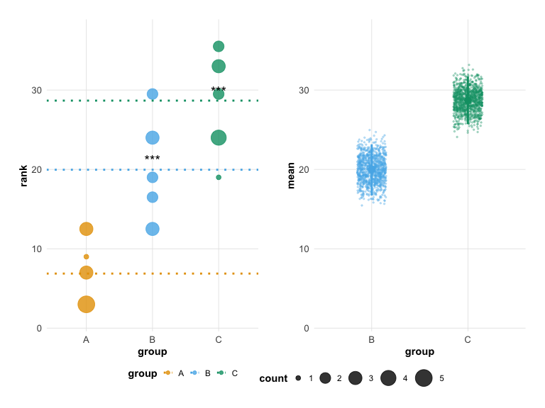<!-- -->

### Effect Size Annotation

Display effect size (difference from control) with confidence intervals:

``` r
plot(hr_effect, show_effect_size = TRUE)
```

    ## Confidence interval: 2.5% - 97.5%

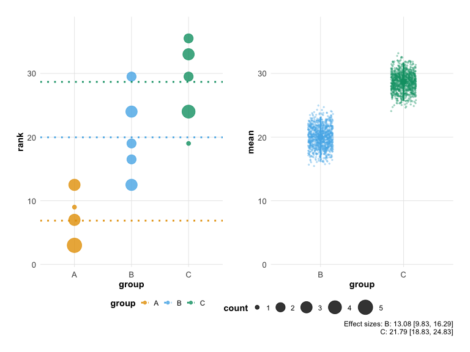<!-- -->

### Computing Statistics Directly

You can also access the significance and effect size calculations
directly:

``` r
# Compute significance
compute_significance(hr_est_1)
```

    ##   group significant p_value stars
    ## 1     A          NA      NA      
    ## 2     B        TRUE       0   ***

``` r
# Compute effect sizes
compute_effect_size(hr_est_1)
```

    ##   group effect effect_ci_low effect_ci_high
    ## 1     A     NA            NA             NA
    ## 2     B   -8.8      -11.1125         -6.795

## Summary Tables

Generate publication-ready summary tables with `besthr_table()`:

``` r
# Default tibble format
besthr_table(hr_effect)
```

    ## # A tibble: 3 × 6
    ##   group     n mean_rank ci_low ci_high effect_size
    ##   <chr> <int>     <dbl>  <dbl>   <dbl>       <dbl>
    ## 1 A        12      6.88   NA      NA          NA  
    ## 2 B        12     20.0    16.7    23.2        13.1
    ## 3 C        12     28.7    25.7    31.7        21.8

``` r
# With significance stars
besthr_table(hr_effect, include_significance = TRUE)
```

    ## # A tibble: 3 × 7
    ##   group     n mean_rank ci_low ci_high effect_size significance
    ##   <chr> <int>     <dbl>  <dbl>   <dbl>       <dbl> <chr>       
    ## 1 A        12      6.88   NA      NA          NA   ""          
    ## 2 B        12     20.0    16.7    23.2        13.1 "***"       
    ## 3 C        12     28.7    25.7    31.7        21.8 "***"

### Export Formats

Generate tables in various formats for publication:

``` r
# Markdown format
besthr_table(hr_est_1, format = "markdown")
```

    ## [1] "| group | n | mean_rank | ci_low | ci_high | effect_size |\n| --- | --- | --- | --- | --- | --- |\n| A | 10 | 14.9 | NA | NA | NA |\n| B | 10 |  6.1 | 3.79 | 8.1 | -8.8 |"

``` r
# HTML format
besthr_table(hr_est_1, format = "html")

# LaTeX format
besthr_table(hr_est_1, format = "latex")
```

## Publication Export

Save your plots directly to publication-quality files:

``` r
# Save to PNG (default 300 DPI)
save_besthr(hr_est_1, "figure1.png")

# Save to PDF
save_besthr(hr_est_1, "figure1.pdf", width = 10, height = 8)

# Save raincloud plot
save_besthr(hr_est_1, "raincloud.png", type = "raincloud")

# With custom options
save_besthr(hr_est_1, "figure1.png",
            theme = "modern",
            colors = "okabe_ito",
            width = 10,
            height = 6,
            dpi = 600)
```

Supported formats: PNG, PDF, SVG, TIFF, JPEG
