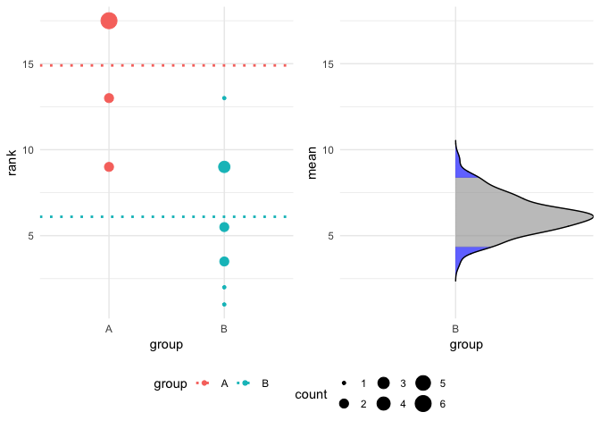

besthr - Generating Bootstrap Estimation Distributions of HR Data
================
Dan MacLean
12/06/2019

<<<<<<< HEAD
<!-- badges: start --> \](<https://travis-ci.org/TeamMacLean/besthr>)
=======
<!-- badges: start --> [](https://travis-ci.org/TeamMacLean/besthr)
>>>>>>> 473a6dbc81fd31fb1f08111c0e5b1cafd0306a44
<!-- badges: end -->

## Synopsis

besthr is a package that creates plots showing scored HR experiments and
plots of distribution of means of ranks of HR score from bootstrapping.

``` r
library(besthr)
hr_data_1_file <- system.file("extdata", "example-data-1.csv", package = "besthr")
hr_data_1 <- readr::read_csv(hr_data_1_file)
```

    ## Parsed with column specification:
    ## cols(
    ##   score = col_double(),
    ##   group = col_character()
    ## )

``` r
head(hr_data_1)
```

    ## # A tibble: 6 x 2
    ##   score group
    ##   <dbl> <chr>
    ## 1    10 A    
    ## 2     9 A    
    ## 3    10 A    
    ## 4    10 A    
    ## 5     8 A    
    ## 6     8 A

``` r
hr_est_1 <- estimate(hr_data_1, score, group, control = "A")
hr_est_1
```

    ## besthr (HR Rank Score Analysis with Bootstrap Estimation)
    ## =========================================================
    ## 
    ## Control: A
    ## 
    ## Unpaired mean rank difference of A (14.9, n=10) minus B (6.1, n=10)
    ##  8.8
    ## Confidence Intervals (0.025, 0.975)
<<<<<<< HEAD
    ##  4.3475, 8.37875
=======
    ##  3.61625, 8.02625
>>>>>>> 473a6dbc81fd31fb1f08111c0e5b1cafd0306a44
    ## 
    ## 100 bootstrap resamples.

``` r
plot(hr_est_1)
```

<<<<<<< HEAD
    ## Picking joint bandwidth of 0.361
=======
    ## Picking joint bandwidth of 0.364
>>>>>>> 473a6dbc81fd31fb1f08111c0e5b1cafd0306a44

<!-- -->

## Installation

``` r
devtools::install_github("TeamMacLean/besthr")
```

## Usage

### Simplest Use Case - Two Groups, No Replicates

With a data frame or similar object, use the `estimate()` function to
get the bootstrap estimates of the ranked data.

`estimate()` has a basic function call as follows:

`estimate(data, score_column_name, group_column_name, control =
control_group_name)`

The first argument after the data frame is the title of the score
column, the second the title of the group (or sample) column.

``` r
library(besthr)

hr_data_1_file <- system.file("extdata", "example-data-1.csv", package = "besthr")
hr_data_1 <- readr::read_csv(hr_data_1_file)
```

    ## Parsed with column specification:
    ## cols(
    ##   score = col_double(),
    ##   group = col_character()
    ## )

``` r
head(hr_data_1)
```

    ## # A tibble: 6 x 2
    ##   score group
    ##   <dbl> <chr>
    ## 1    10 A    
    ## 2     9 A    
    ## 3    10 A    
    ## 4    10 A    
    ## 5     8 A    
    ## 6     8 A

``` r
hr_est_1 <- estimate(hr_data_1, score, group, control = "A")
hr_est_1
```

    ## besthr (HR Rank Score Analysis with Bootstrap Estimation)
    ## =========================================================
    ## 
    ## Control: A
    ## 
    ## Unpaired mean rank difference of A (14.9, n=10) minus B (6.1, n=10)
    ##  8.8
    ## Confidence Intervals (0.025, 0.975)
<<<<<<< HEAD
    ##  4.2975, 8.19124999999999
=======
    ##  4, 8.5525
>>>>>>> 473a6dbc81fd31fb1f08111c0e5b1cafd0306a44
    ## 
    ## 100 bootstrap resamples.

``` r
plot(hr_est_1)
```

<<<<<<< HEAD
    ## Picking joint bandwidth of 0.354
=======
    ## Picking joint bandwidth of 0.381
>>>>>>> 473a6dbc81fd31fb1f08111c0e5b1cafd0306a44

<!-- -->

#### Setting Options

You may select the group to set as the common reference control with
`control`.

``` r
estimate(hr_data_1, score, group, control = "B" ) %>%
  plot()
```

<<<<<<< HEAD
    ## Picking joint bandwidth of 0.241
=======
    ## Picking joint bandwidth of 0.415
>>>>>>> 473a6dbc81fd31fb1f08111c0e5b1cafd0306a44

<!-- -->

You may select the number of iterations of the bootstrap to perform with
`nits` and the quantiles for the confidence interval with `low` and
`high`.

``` r
estimate(hr_data_1, score, group, control = "A", nits = 1000, low = 0.4, high = 0.6) %>%
  plot()
```

<<<<<<< HEAD
    ## Picking joint bandwidth of 0.262
=======
    ## Picking joint bandwidth of 0.254
>>>>>>> 473a6dbc81fd31fb1f08111c0e5b1cafd0306a44

<!-- -->

### Extended Use Case - Technical Replicates

You can extend the `estimate()` options to specify a third column in the
data that contains technical replicate information, add the technical
replicate column name after the sample column. Technical replicates are
automatically merged using the `mean()` function before
ranking.

``` r
hr_data_3_file <- system.file("extdata", "example-data-3.csv", package = "besthr")
hr_data_3 <- readr::read_csv(hr_data_3_file)
```

    ## Parsed with column specification:
    ## cols(
    ##   score = col_double(),
    ##   sample = col_character(),
    ##   rep = col_double()
    ## )

``` r
head(hr_data_3)
```

    ## # A tibble: 6 x 3
    ##   score sample   rep
    ##   <dbl> <chr>  <dbl>
    ## 1     8 A          1
    ## 2     9 A          1
    ## 3     8 A          1
    ## 4    10 A          1
    ## 5     8 A          2
    ## 6     8 A          2

``` r
hr_est_3 <- estimate(hr_data_3, score, sample, rep, control = "A")

hr_est_3
```

    ## besthr (HR Rank Score Analysis with Bootstrap Estimation)
    ## =========================================================
    ## 
    ## Control: A
    ## 
    ## Unpaired mean rank difference of A (5, n=3) minus B (2, n=3)
    ##  3
    ## Confidence Intervals (0.025, 0.975)
<<<<<<< HEAD
    ##  1, 2.66666666666667
=======
    ##  1, 2.84166666666666
>>>>>>> 473a6dbc81fd31fb1f08111c0e5b1cafd0306a44
    ## 
    ## Unpaired mean rank difference of A (5, n=3) minus C (8, n=3)
    ##  -3
    ## Confidence Intervals (0.025, 0.975)
<<<<<<< HEAD
    ##  7.33333333333333, 8.66666666666667
=======
    ##  7, 8.66666666666667
>>>>>>> 473a6dbc81fd31fb1f08111c0e5b1cafd0306a44
    ## 
    ## 100 bootstrap resamples.

``` r
plot(hr_est_3)
```

<<<<<<< HEAD
    ## Picking joint bandwidth of 0.172
=======
    ## Picking joint bandwidth of 0.171
>>>>>>> 473a6dbc81fd31fb1f08111c0e5b1cafd0306a44

<!-- -->

#### Alternate Plot Options

In the case where you have use technical replicates and want to see
those plotted you can use an extra plot option `which`. Set `which` to
`just_data` if you wish the left panel of the plot to show all data
without ranking. This will only work if you have technical replicates.

``` r
hr_est_3 %>% 
  plot(which = "just_data")
```

<<<<<<< HEAD
    ## Picking joint bandwidth of 0.172
=======
    ## Picking joint bandwidth of 0.171
>>>>>>> 473a6dbc81fd31fb1f08111c0e5b1cafd0306a44

<!-- -->
